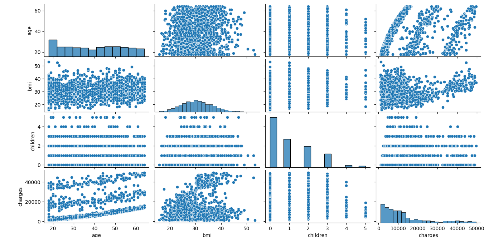

# Medical Cost Prediction

This project uses linear regression to predict medical costs based on factors like age, BMI, smoking habits, and region. It includes data exploration, feature engineering, and model building to estimate individual medical charges, benefiting both insurers and policyholders.

## Table of Contents

- [Introduction](#introduction)
- [Context](#context)
- [Process](#process)
  - [Importing Libraries and Loading the Dataset](#import)
  - [Data Preprocessing](#understand)
  - [Data Transformation](#transformation)
  - [Initial Linear Regression Model](#initial)
  - [Improving the Linear Regression Model](#improve)

## [Introduction](#introduction)

In this project, we tackle the task of predicting individual medical costs billed by health insurance providers based on a dataset containing various factors such as age, gender, body mass index (BMI), number of children, smoking habits, residential region, and more. We employ linear regression techniques to understand and model the relationships between these factors and medical charges. The project involves data exploration, feature engineering, and the creation of predictive models. Our goal is to build an accurate model that can estimate medical costs, providing valuable insights for both insurance providers and individuals.

## [Context](#context)

1. age: age of primary beneficiary
2. sex: insurance contractor gender, female, male
3. bmi: Body mass index, providing an understanding of body, weights that are relatively high or low relative to height,
objective index of body weight (kg / m ^ 2) using the ratio of height to weight, ideally 18.5 to 24.9
4. children: Number of children covered by health insurance / Number of dependents
5. smoker: Smoking
6. region: the beneficiary's residential area in the US, northeast, southeast, southwest, northwest.
7. charges: Individual medical costs billed by health insurance

## [Process](#process)


### [Importing Libraries and Loading the Dataset](#import)

In this initial step, we import the necessary Python libraries, including pandas, numpy, seaborn, matplotlib, scikit-learn, and regressors for statistical summaries. We then load the medical insurance dataset from a local file and display some initial information about it, such as the data types, shape, and a histogram of the 'charges' column to understand the distribution of medical costs.

```python
import pandas as pd
import numpy as np
import seaborn as sns
import matplotlib.pyplot as plt
import sklearn.metrics as metrics

from sklearn.preprocessing import StandardScaler
from sklearn.linear_model import LinearRegression
from sklearn.model_selection import train_test_split
from regressors import stats

data_path = r'..\insurance.csv'
df = pd.read_csv(data_path)

df.head()
print(df.dtypes)
print(df.shape)

df.charges.hist(bins=40)
```


### [Data Preprocessing](#understand)

In this step, we perform data preprocessing and visualization:

- We remove outlier data points where 'charges' exceed $50,000 to improve the quality of our analysis.
- We create a pair plot to visualize pairwise relationships between numeric variables, helping us understand potential correlations.
- We calculate and visualize the correlation matrix to quantify the relationships among numeric variables, particularly focusing on their impact on 'charges.'

```python
df = df[df['charges'] < 50000]

sns.pairplot(df, height=2.5)
plt.show()
```



```python
numeric_cols = ['age', 'bmi', 'children', 'charges']
correlation_matrix = np.corrcoef(df[numeric_cols].values.T)
sns.set(font_scale=1.5)
sns.heatmap(correlation_matrix, annot=True, yticklabels=numeric_cols, xticklabels=numeric_cols)
```


### [Data Transformation](#transformation)

In this step, we transform the data and perform feature engineering:

- We apply one-hot encoding to categorical variables 'sex', 'smoker', and 'region' to convert them into numeric format for modeling.
- We define predictor variables (X) and the target variable (y).
- The data is split into training and testing sets.
- Predictor variables (X) and the target variable (y) are standardized using StandardScaler to ensure consistent scaling for modeling.

```python
df = pd.get_dummies(df, columns=['sex', 'smoker', 'region'], drop_first=True)

X_cols = list(set(df.columns) - {'charges'})
y_col = ['charges']

X = df[X_cols].values
y = df[y_col].values

X_train, X_test, y_train, y_test = train_test_split(X, y)

sc_x = StandardScaler().fit(X)
sc_y = StandardScaler().fit(y)

X_train = sc_x.transform(X_train)
X_test = sc_x.transform(X_test)
y_train = sc_y.transform(y_train)
y_test = sc_y.transform(y_test)
```


### [Initial Linear Regression Model](#initial)

In this step, we build and evaluate an initial Linear Regression model:

- We create a Linear Regression model and fit it to the standardized training data.
- The model is used to make predictions on the test data, and we calculate Mean Squared Error (MSE) and R-squared (R2) as evaluation metrics.
- To improve the model summary's readability, we adjust the intercept and coefficients.
- We display a statistical summary of the model using regressors.stats.
- Residuals (differences between predicted and actual values) are visualized to assess model performance.

```python
model = LinearRegression().fit(X_train, y_train)
y_pred = model.predict(X_test)

mse = metrics.mean_squared_error(y_test, y_pred)
r2 = metrics.r2_score(y_test, y_pred)

print("MSE:", mse.round(4))
print("R-squared:", r2.round(4))

# Adjust model intercept and coefficients for a more readable summary
model.intercept_ = model.intercept_[0]
model.coef_ = model.coef_.reshape(-1)

# Reshape the y_test data for statistical summary
y_test = y_test.reshape(-1)

print("==========Summary==========")
stats.summary(model, X_test, y_test, X_cols)
```


```python
residuals = np.subtract(y_test, y_pred.reshape(-1))
plt.scatter(y_pred, residuals)
plt.show()
```


### [Improving the Linear Regression Model](#improve)

Feature engineering is a critical aspect of model improvement. We create three additional features:

- 'age2': The square of the 'age' feature. This captures potential nonlinear relationships between age and medical charges, which the initial model might not have captured.

- 'sobrepeso': A binary feature (1 for BMI >= 30, 0 otherwise) indicating whether a person is overweight or not. This additional information can help the model account for the impact of BMI on medical charges more accurately.

- 'sobrepeso*fumador': An interaction feature between 'sobrepeso' and 'smoker_yes'. This accounts for the combined effect of being overweight and being a smoker, which might have a different impact on medical costs compared to each factor individually.

```python
df_second = df.copy()

df_second['age2'] = df_second.age**2
df_second['sobrepeso'] = (df_second.bmi >= 30).astype(int)
df_second['sobrepeso*fumador'] = df_second.sobrepeso * df_second.smoker_yes
```

We define a new set of predictor variables (X_cols) that includes the features we created in the previous step. The target variable (y_col) remains the same ('charges'). By updating the predictor variables, we ensure that our model considers the newly introduced features when making predictions.

```python
X_cols = ['sobrepeso*fumador', 'smoker_yes', 'age2', 'children']

X = df_second[X_cols].values
y = df_second[y_col].values
```

We split the updated data into training and testing sets, following a similar process as in the initial model. Splitting the data helps us assess the model's performance on unseen data.

Additionally, we standardize both predictor variables (X) and the target variable (y) using StandardScaler. Standardization ensures that all variables have a mean of 0 and a standard deviation of 1, which can improve model convergence and performance.

```python
X_train, X_test, y_train, y_test = train_test_split(X, y)

sc_x = StandardScaler().fit(X)
sc_y = StandardScaler().fit(y)

X_train = sc_x.transform(X_train)
X_test = sc_x.transform(X_test)
y_train = sc_y.transform(y_train)
y_test = sc_y.transform(y_test)
```

We create a new Linear Regression model, specifying fit_intercept=False because we want the model to consider the entire feature space without adding an intercept term. This decision aligns with the chosen feature engineering approach.

```python
model = LinearRegression(fit_intercept=False)
model.fit(X_train, y_train)
```

We use the new model to make predictions on the test data and evaluate its performance using two important metrics:

- R-squared (R2): This metric measures how well the model explains the variance in the target variable. A higher R2 indicates a better fit to the data.

- Mean Squared Error (MSE): MSE measures the average squared difference between predicted and actual values. Lower MSE values indicate better model accuracy.

```python
y_pred = model.predict(X_test)

r2 = metrics.r2_score(y_test, y_pred)
mse = metrics.mean_squared_error(y_test, y_pred)

print("R-squared (R2):", r2.round(4))
print("Mean Squared Error (MSE):", mse.round(4))
```

To improve the readability of the model summary, we adjust the intercept and coefficients. This step makes it easier to interpret the model's impact on the target variable.

We then display a statistical summary of the linear regression model using the regressors.stats library, which provides valuable insights into the coefficients and their significance.

Finally, we visualize the residuals (differences between predicted and actual values) to assess how well the model captures the variation in medical charges and whether there are any patterns in the residuals that need further investigation.

In summary, this step demonstrates the importance of feature engineering, model refinement, and evaluation to improve the accuracy of the linear regression model. The introduced features and modifications aim to capture complex relationships in the data and enhance the model's predictive power.

```python
model.intercept_ = model.intercept_[0]
model.coef_ = model.coef_.reshape(-1)

# Reshape the y_test data for statistical summary
y_test = y_test.reshape(-1)

print("==========Summary==========")
stats.summary(model, X_test, y_test, X_cols)
```


```python
residuals = np.subtract(y_test, y_pred.reshape(-1))
plt.scatter(y_pred, residuals)
plt.show()
```


